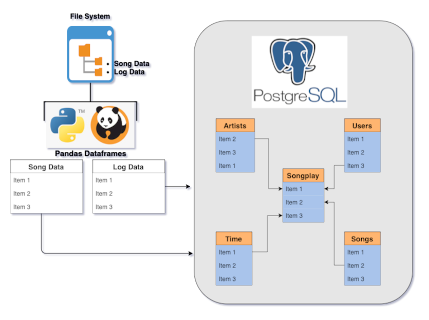

## <b>Project: Data Modeling with Postgresql</b>

### <b>Introduction</b>

A startup called Sparkify wants to analyze the data they've been collecting on songs and user activity on their new music streaming app. The analytics team is particularly interested in understanding what songs users are listening to. Currently, they don't have an easy way to query their data, which resides in a directory of JSON logs on user activity on the app, as well as a directory with JSON metadata on the songs in their app.

### <b>Project Description</b>

A solution to establish the ability to query their data which currently resides in json files is to create & populate a data model in a Relational Database Management System - categorically Postgresql.
The Postgresql database can be leveraged to create a star schema which would comprise of a central Fact table and Dimension tables arranged in a Denormalized fashion which not only helps make the data model easy to understand from a Business perspective but also helps perform efficient OLTP operations on the data. 
In order to make the ETL process efficient, Pandas Dataframes can be leveraged as a staging tool to load all the data from the songs & logs json files. Looping over a Dataframe would offer more efficiency as opposed to doing the ETL process in pure Python.   

### <b>ETL</b>

1. Write SQL queries in sql_queries.py.
2. Run the create_tables.py script to drop & create the required tables.
<b>Fact Table</b>
    <b>songplays - records in log data associated with song plays i.e. records with page NextSong
       songplay_id, start_time, user_id, level, song_id, artist_id, session_id, location, user_agent
<b>Dimension Tables</b>
    <b>users</b> - users in the app
       user_id, first_name, last_name, gender, level
    <b>songs</b> - songs in music database
       song_id, title, artist_id, year, duration
    <b>artists</b> - artists in music database
       artist_id, name, location, latitude, longitude
    <b>time</b> - timestamps of records in songplays broken down into specific units
       start_time, hour, day, week, month, year, weekday 
3. Run the etl.py script to load the songs & logs json files into Pandas Dataframes & then load the data from the Dataframes into the corresponding tables created in step 2.

#### <b>ETL Architecture</b>

