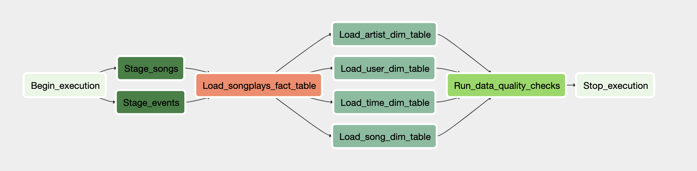

## <b>Project:</b> Data Pipeline with Airflow

### <b>Introduction</b>

A music streaming company, Sparkify, has decided that it is time to introduce more automation and monitoring to their data warehouse ETL pipelines and come to the conclusion that the best tool to achieve this is Apache Airflow.

They have decided to bring you into the project and expect you to create high grade data pipelines that are dynamic and built from reusable tasks, can be monitored, and allow easy backfills. They have also noted that the data quality plays a big part when analyses are executed on top the data warehouse and want to run tests against their datasets after the ETL steps have been executed to catch any discrepancies in the datasets.

The source data resides in S3 and needs to be processed in Sparkify's data warehouse in Amazon Redshift. The source datasets consist of JSON logs that tell about user activity in the application and JSON metadata about the songs the users listen to.

### <b>Project Description</b>

The Project aims at developing an automated Airflow Data pipeline. This will be achieved by leveraging a combination of Airflow's in-built & user-defined functionality. 

Several stages in the pipeline will be defined using user-defined Operators and will be arranged in a specific order of precedence. 

Each Operator will utilize Airflow's in-built hooks to connect to the AWS cloud and perform SQL operations on Redshift.

### <b>Project Datasets</b>

<b>Song Data Path</b> --> s3://udacity-dend/song_data 

<b>Log Data Path</b> --> s3://udacity-dend/log_data Log Data 

### <b>Project Template</b>

The project template package contains three major components for the project:

The <b>dag template</b> has all the imports and task templates in place, but the task dependencies have not been set
The <b>operators</b> folder with operator templates
A <b>helper</b> class for the SQL transformations

<b>Configuring the DAG</b>

In the DAG, add default parameters according to these guidelines

1. The DAG does not have dependencies on past runs
2. On failure, the task are retried 3 times
3. Retries happen every 5 minutes
4. Catchup is turned off
5. Do not email on retry

<b>Building the Operators</b>

We need to build four different operators that will stage the data, transform the data, and run checks on data quality. All of the operators and task instances will run SQL statements against the Redshift database. However, using parameters wisely will allow you to build flexible, reusable, and configurable operators you can later apply to many kinds of data pipelines with Redshift and with other databases.

<b>Stage Operator</b>

The stage operator is expected to be able to load any JSON and CSV formatted files from S3 to Amazon Redshift. The operator creates and runs a SQL COPY statement based on the parameters provided. The operator's parameters should specify where in S3 the file is loaded and what is the target table.

The parameters should be used to distinguish between JSON and CSV file. Another important requirement of the stage operator is containing a templated field that allows it to load timestamped files from S3 based on the execution time and run backfills.

<b>Fact and Dimension Operators</b>

Provided SQL Helper class will help to run data transformations. Most of the logic is within the SQL transformations and the operator is expected to take as input a SQL statement and target database on which to run the query against. Dimension loads are often done with the truncate-insert pattern where the target table is emptied before the load. Fact tables are usually so massive that they should only allow append type functionality.

<b>Data Quality Operator</b>

The final operator to create is the data quality operator, which is used to run checks on the data itself. The operator's main functionality is to receive one or more SQL based test cases along with the expected results and execute the tests. For each the test, the test result and expected result needs to be checked and if there is no match, the operator should raise an exception and the task should retry and fail eventually.

For example one test could be a SQL statement that checks if certain column contains NULL values by counting all the rows that have NULL in the column. We do not want to have any NULLs so expected result would be 0 and the test would compare the SQL statement's outcome to the expected result.

### <b>Airflow Graph View</b>
