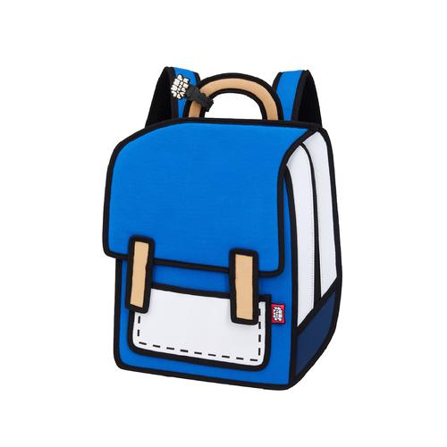
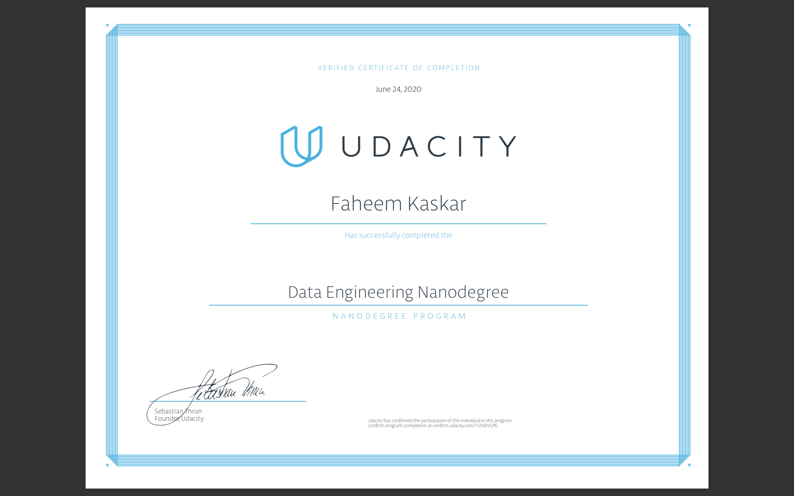

#### Wondering why the backpack? 
Well...I've gotten into this habit of carrying my backpack with me wherever I go. Be it grocery shopping, 
roaming around in my office space or just about any place I go, I always have my backpack with me. Everyone recognizes me as the guy
with the backpack. Ergo...

#### What can you find in the backpack?

1. Lightening in a bottle
2. A goose that lays golden eggs
3. An Elephant that can fly

Gotcha! I wish the backpack could offer you what's mentioned above (if you know a place, I'm all ears), but the idea behind the backpack
is pretty simple. 

The backpack serves as a place that stores all my learnings & hacks I've picked up over the years.

Especially when it comes to coding, there is usually a lot of boilerplate stuff involved.
This is where backpack comes in handy. It can have a variety of items like - 
     
     * The packages, the client setup, query format, etc that you need to interact with Elasticsearch using Python
     * Several AWS Clients
     * Using boto3 to call AWS services
     * Several Pandas functions
     etc
     
The backpack also includes several Projects I've completed over the last few months with a good amount of documentation and some cool pictures.
(Please check out [**DataEngineerNanoDegree**](https://github.com/kfaheem/backpack/tree/dev/DataEngineerNanoDegree))

Since this is my backpack, I also get free access to a few bragging rights! 

So you may find a bunch of my accomplishments too! (I'm very humble otherwise though)

### **Data Engineering Nanodegree**
***

